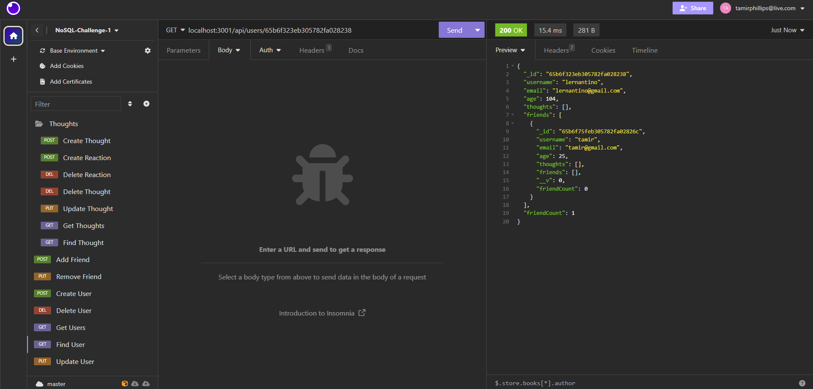

# Project Information

In this challenge, I used MongoDB(Mongoose) to create a social-network-API in which created users can create thoughts, add friends to their friendslist, and add reactions to thoughts. These features can be tested using Insomnia to hit specific routes.

## Acceptance Criteria

GIVEN a social network API
WHEN I enter the command to invoke the application
THEN my server is started and the Mongoose models are synced to the MongoDB database
WHEN I open API GET routes in Insomnia for users and thoughts
THEN the data for each of these routes is displayed in a formatted JSON
WHEN I test API POST, PUT, and DELETE routes in Insomnia
THEN I am able to successfully create, update, and delete users and thoughts in my database
WHEN I test API POST and DELETE routes in Insomnia
THEN I am able to successfully create and delete reactions to thoughts and add and remove friends to a user’s friend list

### Live website and repo

https://github.com/TamirP123/sql-employee-tracker

#### Photo of application

#### Video Walthrough

https://drive.google.com/file/d/1wwYN9KoLPLwdldsh_Kthkvl-Y5IW1UF4/view
